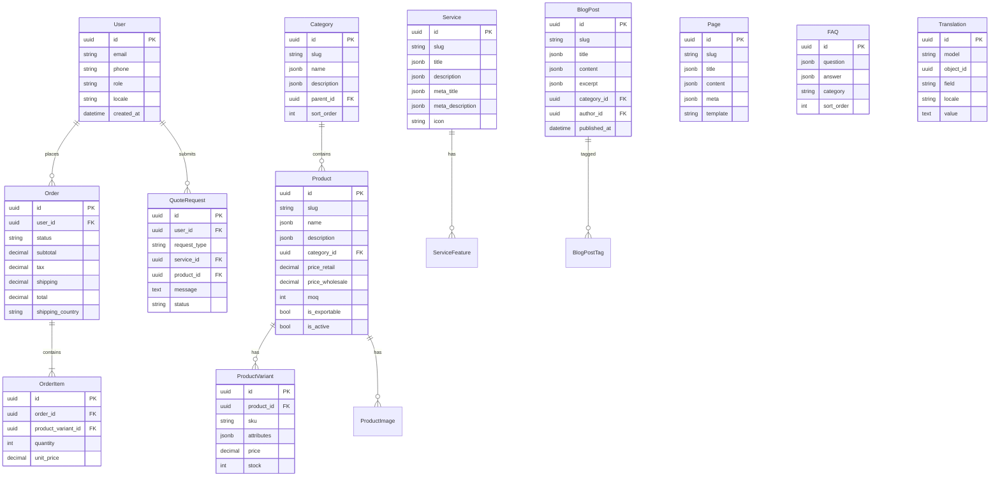

# Database Schema — Sanat Food Platform

## ER Diagram



## Key Tables Summary

| Table | Rows (est. Y1) | Purpose |
|-------|----------------|---------|
| products | 500+ | Product catalog |
| product_variants | 2,000+ | SKUs, sizes, grades |
| services | 50+ | Consulting services |
| blog_posts | 200+ | SEO content hub |
| pages | 100+ | CMS landing pages |
| orders | 10,000+ | E-commerce transactions |
| users | 5,000+ | Customers + admins |
| translations | 50,000+ | Multilingual content |

## Indexing Strategy

```sql
-- SEO-critical indexes
CREATE INDEX idx_product_slug ON products(slug);
CREATE INDEX idx_service_slug ON services(slug);
CREATE INDEX idx_blog_slug ON blog_posts(slug);
CREATE INDEX idx_blog_published ON blog_posts(published_at DESC);

-- E-commerce indexes
CREATE INDEX idx_order_user ON orders(user_id, created_at DESC);
CREATE INDEX idx_product_category ON products(category_id, is_active);
CREATE INDEX idx_variant_sku ON product_variants(sku);

-- Full-text search (Meilisearch sync via Celery)
-- PostgreSQL fallback:
CREATE INDEX idx_product_search ON products USING gin(to_tsvector('simple', name::text));
```

## Pricing Tiers

| Tier | Field | Description |
|------|-------|-------------|
| Retail (B2C) | `price_retail` | Individual buyers |
| Wholesale (B2B) | `price_wholesale` | Bulk orders |
| Export | `price_export` | International buyers |
| MOQ | `moq` | Minimum order quantity |
